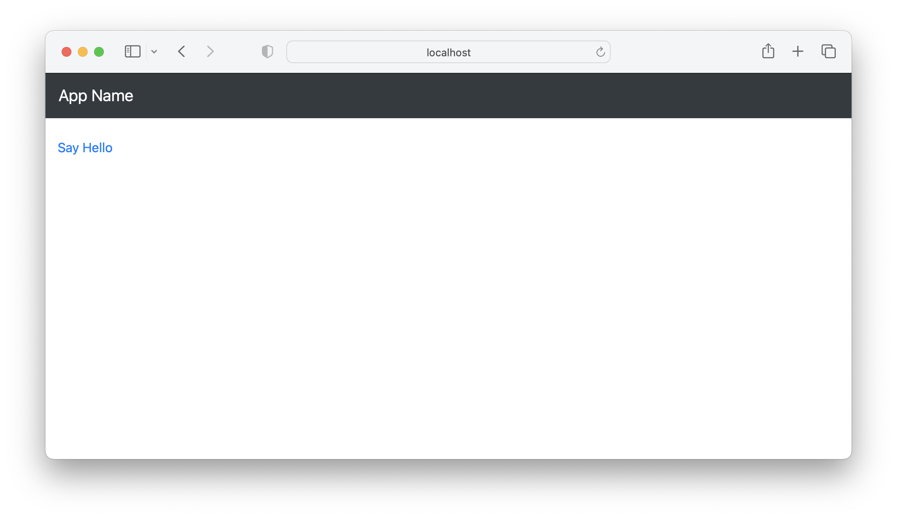
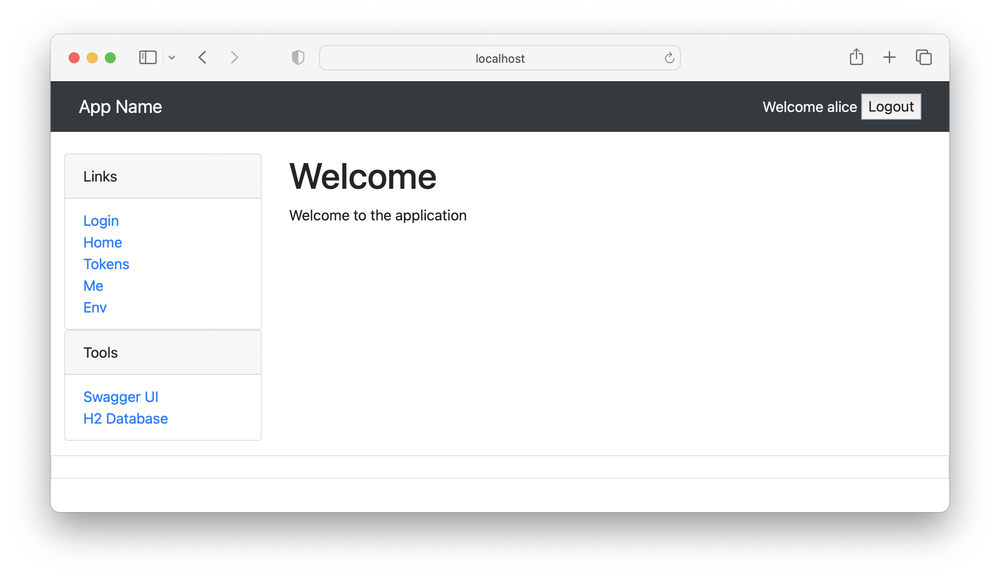

Maven Archetypes
================

[](https://github.com/mpuening/maven-archetypes/actions/workflows/ci.yml)

This project contains a suite of Maven Archetypes.

To install these archetypes, run this command:

```
./mvnw clean install
```

POM Project
===========

To create an POM Project, run this command:

```
mvn archetype:generate \
    -Darchetype.interactive=false --batch-mode \
    -DarchetypeGroupId=io.github.mpuening \
    -DarchetypeArtifactId=maven-archetypes-pom \
    -DarchetypeVersion=0.0.1-SNAPSHOT \
    -DgroupId=org.example.project \
    -DartifactId=my-pom-project \
    -Dversion=0.0.1-SNAPSHOT
```

Note: replace the `groupId` and `artifactId` and `version` on the last lines of the 
command as needed.

Empty Application
=================

To create an empty application with a test case, run this command:

```
mvn archetype:generate \
    -Darchetype.interactive=false --batch-mode \
    -DarchetypeGroupId=io.github.mpuening \
    -DarchetypeArtifactId=maven-archetypes-empty \
    -DarchetypeVersion=0.0.1-SNAPSHOT \
    -DgroupId=org.example.emptyapp \
    -DartifactId=my-empty-app \
    -Dversion=0.0.1-SNAPSHOT
```

Note: replace the `groupId` and `artifactId` and `version` on the last lines of the 
command as needed.

JSP Application
===============

To create a simple JSP application with database support that works with Open Liberty, GlassFish, WildFly and TomEE, run this command:

```
mvn archetype:generate \
    -Darchetype.interactive=false --batch-mode \
    -DarchetypeGroupId=io.github.mpuening \
    -DarchetypeArtifactId=maven-archetypes-jsp-war \
    -DarchetypeVersion=0.0.1-SNAPSHOT \
    -DgroupId=org.example.jspapp \
    -DartifactId=my-jsp-app \
    -Dversion=0.0.1-SNAPSHOT
```

Note: replace the `groupId` and `artifactId` and `version` on the last lines of the 
command as needed.

Here is a screen shot of the application.



JSF Application
===============

To create a simple JSF application with a login form and a Bootstrap UI, along with
database support and LDAP support that works with Open Liberty, GlassFish, WildFly
and TomEE, run this command:

```
mvn archetype:generate \
    -Darchetype.interactive=false --batch-mode \
    -DarchetypeGroupId=io.github.mpuening \
    -DarchetypeArtifactId=maven-archetypes-jsf-war \
    -DarchetypeVersion=0.0.1-SNAPSHOT \
    -DgroupId=org.example.jsfapp \
    -DartifactId=my-jsf-app \
    -Dversion=0.0.1-SNAPSHOT
```

Note: replace the `groupId` and `artifactId` and `version` on the last lines of the 
command as needed.

Here is a screen shot of the application.


JAX-RS API
==========

To create a simple JAX-RS API application with database support that works with
Open Liberty, GlassFish, WildFly and TomEE, run this command:

```
mvn archetype:generate \
    -Darchetype.interactive=false --batch-mode \
    -DarchetypeGroupId=io.github.mpuening \
    -DarchetypeArtifactId=maven-archetypes-jaxrs-war \
    -DarchetypeVersion=0.0.1-SNAPSHOT \
    -DgroupId=org.example.jaxrsapi \
    -DartifactId=my-jaxrs-api \
    -Dversion=0.0.1-SNAPSHOT
```

Note: replace the `groupId` and `artifactId` and `version` on the last lines of the 
command as needed.

Here is a screen shot of the application.


Spring Boot Thymeleaf Application
=================================

To create a simple Spring Boot Thymeleaf application with a login form and a Bootstrap UI and
support for OAuth2, run this command:

```
mvn archetype:generate \
    -Darchetype.interactive=false --batch-mode \
    -DarchetypeGroupId=io.github.mpuening \
    -DarchetypeArtifactId=maven-archetypes-spring-boot-thymeleaf-app \
    -DarchetypeVersion=0.0.1-SNAPSHOT \
    -DgroupId=org.example.springbootapp \
    -DartifactId=my-spring-boot-app \
    -Dversion=0.0.1-SNAPSHOT
```

Note: replace the `groupId` and `artifactId` and `version` on the last lines of the 
command as needed.

This Spring Boot application bizarrely combines all the following into a single application:

* Thymeleaf Web Application
* LDAP Server
* Authorization (OAuth2) Server (binds to LDAP server above)
* OAuth2 Client (for web application authentication)
* OAuth2 Resource Server

It can be good for learning purposes.

Here is a screen shot of the application.



Spring Boot SPA Application
===============================

> [!WARNING]  
> This project is a work in progress and not yet complete.

To create a simple Spring Boot SPA application with a login form and
a Bootstrap UI and support for OAuth2, run one of the following commands.

For an Angular application:


```
mvn archetype:generate \
    -Darchetype.interactive=false --batch-mode \
    -DarchetypeGroupId=io.github.mpuening \
    -DarchetypeArtifactId=maven-archetypes-spring-boot-spa-app \
    -DarchetypeVersion=0.0.1-SNAPSHOT \
    -DgroupId=org.example.springbootapp \
    -DartifactId=my-spring-boot-app \
    -Dversion=0.0.1-SNAPSHOT
    -DspaType=angular
```

For a VueJS application:


```
mvn archetype:generate \
    -Darchetype.interactive=false --batch-mode \
    -DarchetypeGroupId=io.github.mpuening \
    -DarchetypeArtifactId=maven-archetypes-spring-boot-spa-app \
    -DarchetypeVersion=0.0.1-SNAPSHOT \
    -DgroupId=org.example.springbootapp \
    -DartifactId=my-spring-boot-app \
    -Dversion=0.0.1-SNAPSHOT
    -DspaType=vuejs
```

Note: replace the `groupId` and `artifactId` and `version` on the last lines of the 
command as needed.

This Spring Boot application bizarrely combines all the following into a single application:

* LDAP Server
* Authorization (OAuth2) Server (binds to LDAP server above)
* OAuth2 Resource Server

The SPA code contains the OAuth2 client.

It can be good for learning purposes.

